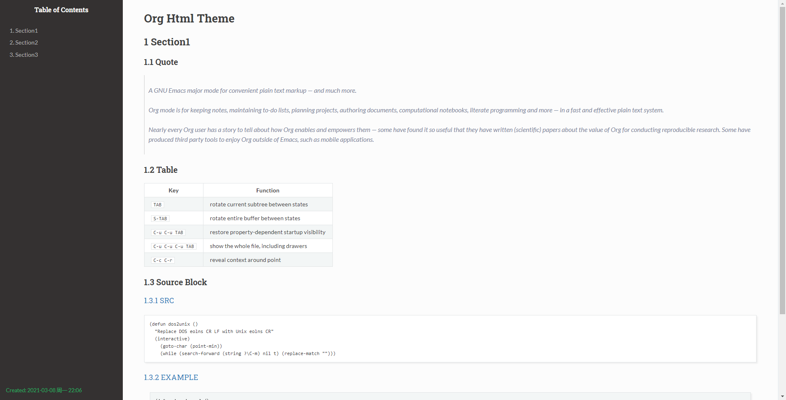
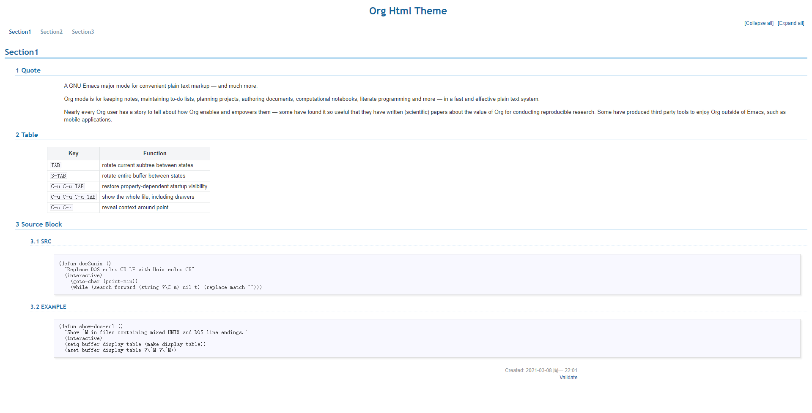
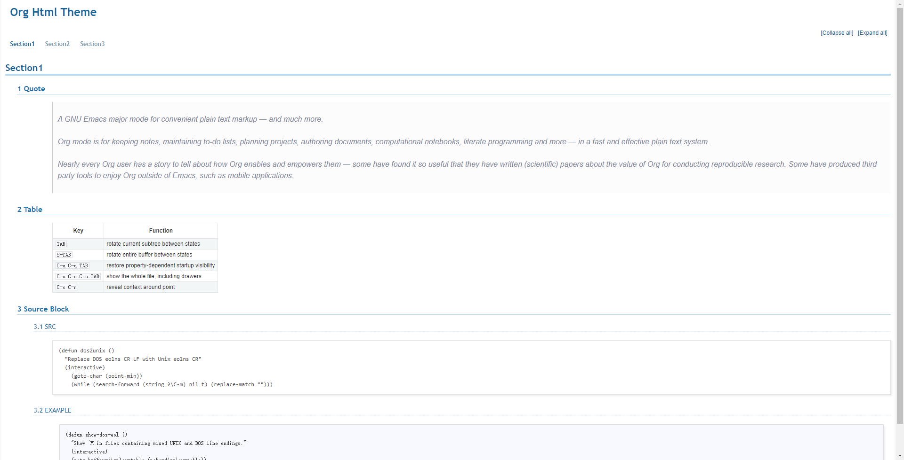

#+AUTHOR: Duang.zou
#+EMAIL: duang.zou@gmail.com

#+SETUPFILE: org/theme-readtheorg.setup

* ReadTheOrg

** Using the theme

base original project:

#+begin_src org :exports code
#+SETUPFILE: https://fniessen.github.io/org-html-themes/org/theme-readtheorg.setup

#+HTML_HEAD: 
#+HTML_HEAD: 
#+HTML_HEAD: 
#+HTML_HEAD: 
#+HTML_HEAD: 
#+HTML_HEAD: 
#+HTML_HEAD: 
#+end_src

or base this project:

#+begin_src org :exports code
#+SETUPFILE: https://zouniandang.github.io/org-html-themes/org/theme-readtheorg.setup
#+end_src

** Preview

#+ATTR_HTML: :width 640

* Bigblow

** Using the theme

base original project:

#+begin_src org :exports code
#+SETUPFILE: https://fniessen.github.io/org-html-themes/org/theme-bigblow.setup

#+HTML_HEAD: 
#+HTML_HEAD: 
#+HTML_HEAD: 
#+HTML_HEAD: 
#+HTML_HEAD: 
#+HTML_HEAD: 
#+HTML_HEAD: 
#+HTML_HEAD: 
#+HTML_HEAD: 
#+HTML_HEAD: 
#+HTML_HEAD: 
#+HTML_HEAD: 
#+end_src

or base this project:

#+begin_src org :exports code
#+SETUPFILE: https://zouniandang.github.io/org-html-themes/org/theme-bigblow.setup
#+end_src

** Preview

#+ATTR_HTML: :width 640

* Combination

** Using the theme

combining ~ReadTheOrg~ and ~Bigblow~

#+begin_src org :exports code
#+SETUPFILE: https://zouniandang.github.io/org-html-themes/org/theme-readtheorg.setup
#+SETUPFILE: https://zouniandang.github.io/org-html-themes/org/theme-bigblow.setup
#+end_src

** Preview

#+ATTR_HTML: :width 640

